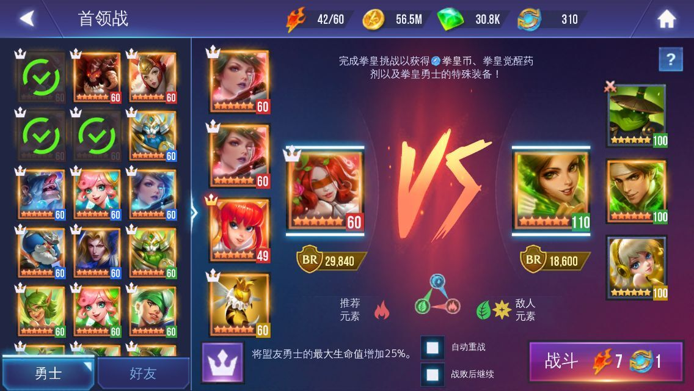
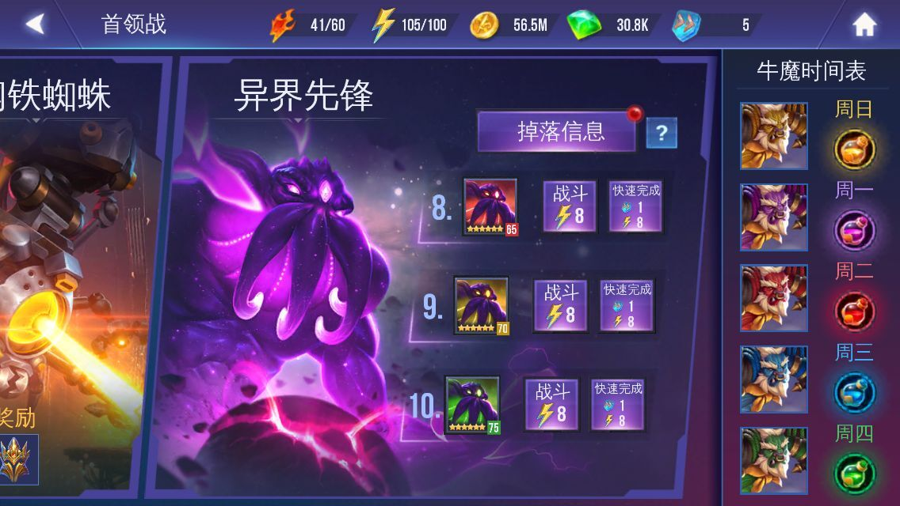

# 2019.12.21

## 2019.12.21

## 注意： 该版本即为 update 8 ，android 与 windows 均已更新，请移步 [update 8](update-8.md) 查看

### 更新渠道

目前该更新仅限国服app store渠道， android / steam / windows store 均无更新，具体更新时间未知 国服iOS玩家，在app store 里即可更新，看不到更新的下拉刷新一下

### 更新成功后的标志

进游戏后有圣诞雪景，邮箱里有礼物。5个速度之石，300个重战币。 如果看不到这些，就杀死游戏，重新进入

### 更新的内容

上面写了，有两个新道具。

#### 1. 重战币

就是自动 再来，在进入战斗前，可以勾选。 可以选择战败后是否继续。

自动重战的通关奖励，会发送到邮箱。所以不用担心背包满的情况

想要取消可以在战斗中直接退出，或者等战斗完毕的结算界面，有3秒钟的时间给你反应，回到主菜单即可

目前在商店里可以免费领取10个

#### 2. 速度之石

神器，可以直接通关，获取通关奖励

目前每天可在商店里免费领取1个

#### 3. 圣诞3件皮肤\#

#### 4. 1v1 聊天，就是发私信

#### 5. 其他更新

1. 牧师头像更新
2. 狙击的1技能描述更新（不是技能更新，自5，6月份开始就是这样，未标记无视50%，标记后无视100%, 只是介绍未更新，所以这次的更新是更新了介绍）

### 评价

对于本次更新，明显对新人更加友好，可以借好友的英雄，通关某个高难度副本后，利用速度之石来刷奖励，这功能就类似国产网游的 扫荡

至于重战石，是给不想越狱和使用电击器玩家的福音

目前两个道具暂未发现的rmb购买渠道

### 注意：

多平台，多设备的玩家，建议保持更新进度一致性。 也就是要么都更新，要么都不更新

如果在已更新的设备上登录过，然后又到了未更新的设备上登录，出现的问题一律概不负责

