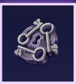

# 黑暗交易

本次活动其实是两个

1. 一个是用隐藏币兑换奖励
2. 另一个是花费金币，挥霍50M获取终极币

本次活动预计持续13天

## 隐藏币 = 马拉松的旗子 = 异界粉尘

隐藏币是本次活动的道具，就是这个东东

### 获取方式

主要是通过刷 **战役** 和 **首领战**，比如传奇6-1 ，刷蜘蛛，刷异界这种

> 印象中马拉松旗子和异界粉尘打竞技场也是掉的，这次的隐藏币貌似不在竞技场掉落

## 总结

所以本次活动非常easy，有钱就花，升级装备，完成金币活动 有体力就刷6-1或者首领战，掉落隐藏币换道具

## 活动毕业

1. 金币的不用说了，50M走起
2. 隐藏币是花费320个毕业 。 刷图大佬的话，假设无限掉落，每天可以20\*6 =120，消耗120个，那320个就是3天的事

## 重点

1. 尽量兑换每天的20\*6那个每日宝箱
2. 2000钻石买Misplaced Change Pack，要比750那个超值包还值。 2000钻= 35抽，平均下来57钻一次，而且5星都挺不错，比稀有币给力
3. 金币活动是有赛事奖励的，有金币就要花，不要藏着掖着，你以为50M就是上限了？只是刚刚起步

