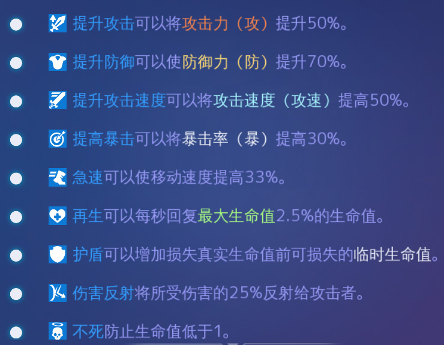
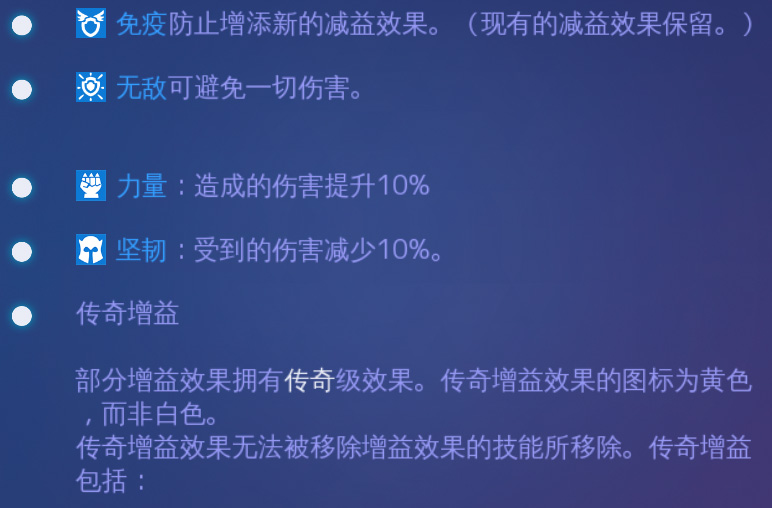
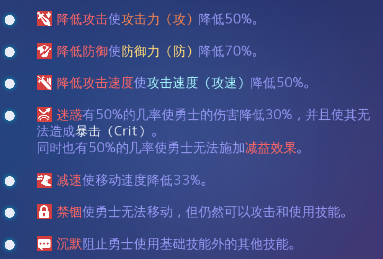
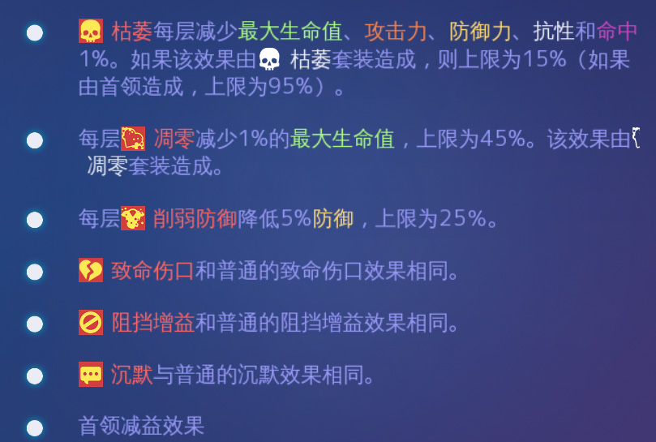
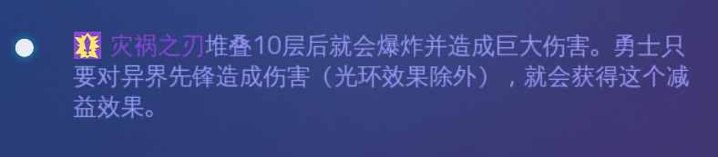

# 技能

这个在 任务-指南 里可以看到，我主要是贴一下，做个备份

## 增益

  

看起来无敌和不死是最牛b的，不过一般都是垂死挣扎。。

免疫是非常实在的，水蛇怪穿能手，技能满级，可以无缝免疫，有了免疫，普通的debuff对你没效果，还是很有用的

## 减益

    

持续伤害 比较厉害，因为这个是按百分比掉血的。。理论上只要你站得住，这个技能一直放，是万金油的套路。。（更新：持续伤害的上限是攻击的300%，这条不知道什么时候加上的，一开始肯定没有）

