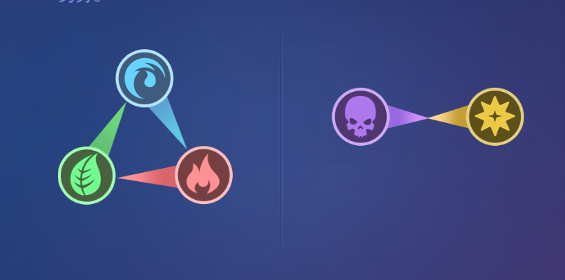
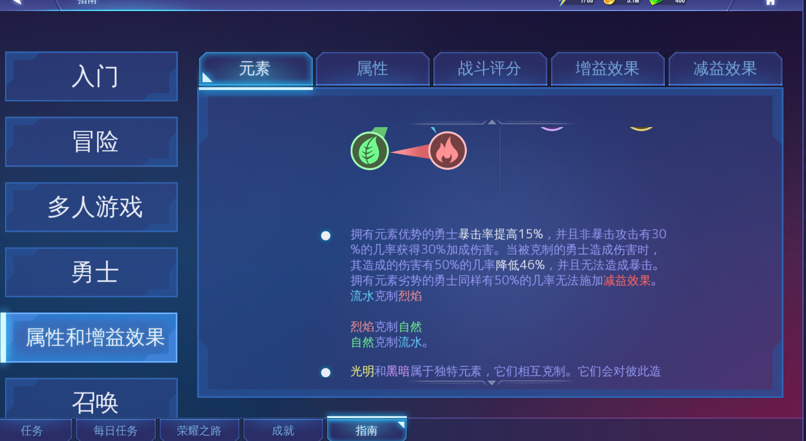
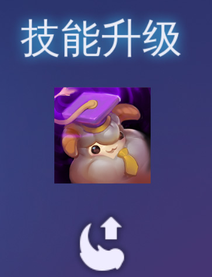

# 英雄\(勇士\)

本片较长，可通过搜索直接找到想看的。比如搜索 平民战队

## 5种元素

英雄是有5种元素的， 火水木，光暗 一共5种 ，克制关系如下

你在游戏里，很可能会听到 光暗 属性的好，这是因为 光暗互相克制，没有被任何元素绝对克制 。 而像水元素，就被 木元素克制

具体的克制数据，可以在游戏里 任务-指南-属性和增益查到。 话说游戏里的大多数信息，都可以在 指南 里看到

注意：被克制是无法暴击的，所以在条件允许的情况下，负责dps的尽量不要被克制。比如木海盗这种主要靠暴击的，如果打火属性，就是个five

## 平民战队

被 [这个英雄值不值得练](zhe-ge-ying-xiong-ff08-yong-shi-ff09-zhi-bu-zhi-de-lian.md) 忽悠过来的可以看这里，毕竟那几个图看起来还是糟糟的，下面说几个平民级别的必备英雄：

1. 木武神 \(减攻击，减防御，减队友技能cd\)
2. 水乌鸦 \(破盾，持续伤害，自身技能cd重置\)
3. 水时间 \(辅助特质：所有队友技能cd -15% , 每5秒，队友技能cd减1s，持续伤害，阻挡增益\)
4. 水蛇怪 \(不停止的免疫效果\)
5. 光天使 \(降低攻击，沉默，上盾，回血，强，无敌\)

上面几乎是可以人人都有的英雄，前面都是3星，只有光天使是5星，可以通过 仪式召唤 获得，虽然麻烦一点，但也算是白给的英雄 。为什么说这些英雄牛b呢，我后面写了特点，大家可以看到，有个状态是非常牛b的，就是减少技能cd，有这个的，都牛b。。因为伤害主要靠技能，你减少技能cd，就相当于多释放几次技能，提高输出，所以，上面那几个英雄，都推荐穿 能手 套装，技能cd -30%

下面说几个更好的，需要一些运气抽的

1. 水少女 \(最强治疗\)
2. 暗少女，同上，水少女是4星，暗少女是3星
3. 暗时间 （比水时间强一个是因为属性不被克制，还有一个是可以移除敌人增益，移除队友减益\)
4. 光蛇怪 （属性不被克制）
5. 木仙子 （攻速极快的变态输出）

上面这几个，虽然是4星，但是都非常容易满技能，因为可以吃3星的同等英雄。 下面说下技能升级

更新：水蛇怪存疑，因为吧里一个真正的大佬说水蛇怪是过时的。我个人觉得如果你需要全程免疫的话，可以练一个 再更新：我理解了大佬的用意。。水蛇怪的确有点过时，除了昏迷，眩晕这种，大部分的减益效果，都可以用水少女移除，所以并不怕debuff，你有水少女，或者有其他能移除减益的英雄就ok了

更新：或许有些新人会问，我的枪将（吕布），赏金猎手，水修女，光星术师都哪去了？这个。。。他们更多的是拿任务奖励用，还有水晶牧师，木地精萨满也是，用途就是拿任务奖励。。。非要我说的话，就是垃圾，不，不要误会，我不是说他们中的哪一个，我是说全部，都是垃圾

更新：治疗需要练一个，参照节奏榜，火修女，火少女都可以，如果你有水少女，那还犹豫什么。。

## 技能升级

满级和不满级，差别还是挺大的

有两种方法

1. 一个是 吃掉，就是训练里 选择 同类英雄，不同元素也可以。 比如 我要升级木仙子的技能，就可以训练里选一个 水仙子，技能就会随机 +1 ，
2. 还有一个是训练 导师绒蛋 ，就是这货

注意，这玩意是稀有物品，**只有5星才配得上他 只有5星才配得上他 只有5星才配得上他** ！！！

目前已知固定获得方式，是每周的pvp商店可以换一个， 每个月的终极试炼里可以拿3个，参加各种活动获得，总之获取难度系数堪称游戏内最高。。 可以说是5星英雄的技能升级专属。。毕竟5星英雄本身就难抽，吃自己升级，这是人能干的出来的事吗。。就算你抽到相同的5星，也建议留着，不要吃。。

## 减技能CD赛高

回到开始，英雄究竟值不值得练，还是得有自己的理解，我的理解上面都写了，减技能cd的我就觉得厉害，或者伤害无视防御的，比如水狙击，木仙子，木海盗，然后还得看对应的场景，你是刷龙，还是刷蜘蛛，还是刷异界，或者打竞技，或者打工会战，场景不同，你的英雄搭配也不同 。 新人阶段，可以优先培养我上面说的5个万金油角色，都60级，基本可以算是渡过新手期了

## 升星

英雄是可以升星的 ，就是3星英雄，也可以升到6星。 所以一个英雄真正的满级是 6星60级 ，说一个英雄值不值得练，也大多是在问 值不值得6星60级，毕竟要升满，还是很费心费神的

下面说下升星 3星30级，吃 3个3星1级的，可以升到4星1级 4星40级，吃4个4星1级，升到5星1级 5星50级，吃5个5星1级，升到6星1级 6星1级 升到 60级，毕业

是不是好麻烦。。被吃的 3星1级 ， 4星1级，5星1级 都可以叫 狗粮，因为被吃了。。。 那么 3星30级， 4星40级 这两个其实也算是狗粮，怎么获得呢 ，一种就是自己练，比如你有3星1级的，就把他升到3星30级，然后吃狗粮升到4星1级，再练级升到4星40级，这个狗粮就算毕业了

带狗粮最佳关卡是传奇6-1，具体参见 [场景战役](../mao-xian/chang-jing-zhan-yi.md)

其实狗粮主要是4星40级的比较难搞，可以在 商店-工会战争 里兑换，4星40级的星彩绒蛋。 通关首领站有几率掉星彩绒蛋，通关终极试炼，有几个关卡必然给星彩绒蛋

星彩绒蛋 有个技巧，满级的星彩绒蛋 吃几个1级，就可以升一个星，所以3星30级，不要直接被吃掉。3星30级的吃3个3星1级的，升到4星1级，再喂给别人

## 觉醒

大部分英雄觉醒后都会加点百分比属性，或者填个技能

觉醒的素材刷牛魔王掉落的药剂，那个建议等到掉落双倍的时候再刷，觉醒带来的提升，远不如升星有效

