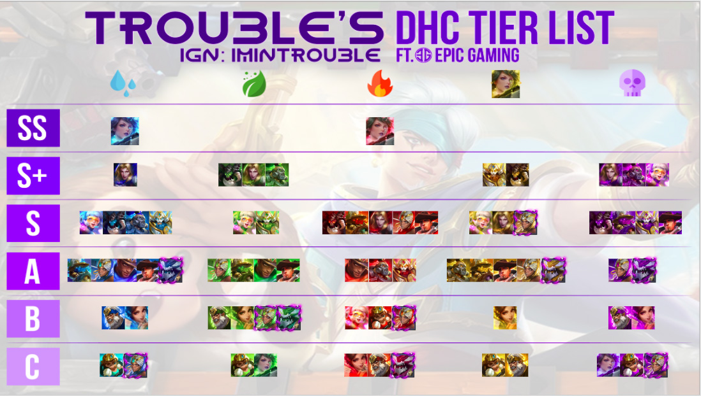
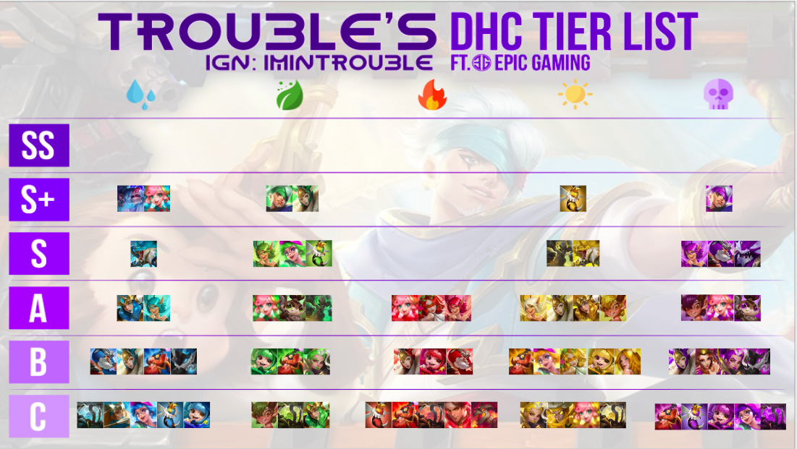
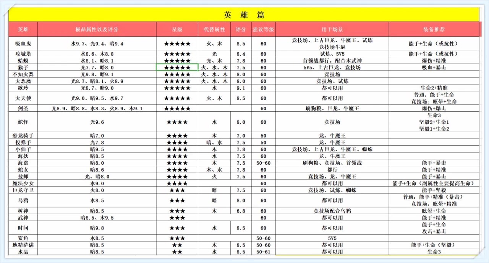

# 这个英雄（勇士）值不值得练

正常来讲，每个人对游戏的理解都不同，值不值得练很难有公认的说法，不过还是有些东西可以参考的，比如下面一个节奏榜，老外整理的，时间是2019年5月

## 12.21 更新

贴吧有两个帖子，对英雄单独分析，可以参考

[https://tieba.baidu.com/p/6197418037](https://tieba.baidu.com/p/6197418037)

[https://tieba.baidu.com/p/6349407967](https://tieba.baidu.com/p/6349407967)

## tier5

> 9月份，狙击排行有变化，单体狙击，火狙击目前最强势。 狙击需要标记，才能发挥全部实力

## tier3、4

## 免责声明

制作上图的老外，已经弃坑了。 而且根据国内大神的说法，那个老外并不咋地。。。

所以是否采纳图中的建议，还是得有自己的分析。 我个人觉得S+这个档次，是可以参考的

## 微信公众号里的，大约是2019年1月

> 不在以上列表里的英雄，要么是新出的还没加进去，要么就是连C级都评不上

## 干货

关于我的个人看法，以及新人该练那些英雄，可以看 [英雄\(勇士\)](ying-96c428-yong-58eb29.md) 这篇

