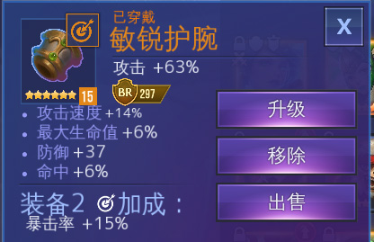

# 装备

下面主要讲一下装备，玩过传奇或者其他网游的都知道，装备 是一款游戏的灵魂。。

## 获得方式

通关场景战役，或者打倒一半的时候，或许就会注意到了，这是一个靠装备的游戏。。游戏里的装备主要靠刷龙 和 刷蜘蛛 获得， 但是新人往往刷不过，因为想要刷龙/蜘蛛需要强力装备，然而强力装备需要刷龙/蜘蛛获得。。这貌似死胡同了，是一个鸡生蛋 还是 蛋生鸡 的问题

先讲下英雄的装备配置吧，在[这个英雄值不值得练](zhe-ge-ying-xiong-ff08-yong-shi-ff09-zhi-bu-zhi-de-lian.md)里有一张图，上面写着推荐的装备配置 ，你要是看一眼的话，会发现很多英雄都是 能手 套装 ，就是 技能cd -30% ，这也和我之前分析的对应上了，减技能cd才是王道。。所以如果你不知道这个英雄上什么套装，穿 能手 肯定是不会差的，一些纯靠物理输出的，可以不选能手，比如水狙击穿好战，木仙子穿加攻速的等等。那么能手装备怎么来呢。。主要是靠刷 蜘蛛

回到刚才的问题，怎么冷启动，就是先吃个蜘蛛，毕竟没有启动装备，蜘蛛1都是打不过去的。这里推荐新人有以下几种方式：

1. 抱大腿，打合作战役。这个不需要体力，不过每个英雄只能出场3次。通关后可以去商店-合作战役里换装备，选能手的
2. 黑市里关注一下，虽然概率低，但是出现了就买着。前期不要管几星，有就买。当全员都是能手套后，再逐渐升星替换

冷启动方式就这样，还有就是抱好友大腿，强刷蜘蛛1，或者刷龙获得一些装备后，英雄等级上来了，刷过蜘蛛1也不难，只要你能刷过蜘蛛1，就解决了冷启动的问题，然后就是 刷蜘蛛-获取能手装备-刷更强的蜘蛛-获取更强的能收装备。。。 这样就启动起来

## 套装

这游戏装备共6个部位，穿一样的可以组成套装，装备有 1个主属性，4个副属性， 属性可以是百分比，也可以是绝对值，稍微玩过几款游戏的都知道，百分比的要比绝对值的好。 所以装备的主属性，尽量选择百分比的，举个例

这是一件 敏锐 装备，最下面写着 装备2 加成 暴击率15% ， 意思就是你6个部位里，有2个 敏锐 装备，就可以 暴击率 +15% ， 还有装备4 的，就是需要4件同类型装备。

并不是所有部位的主属性都是百分比，这个在 任务-指南-装备 里可以看到，只有3个部分的主属性是百分比

**肩甲，护腕 和 手套** 是百分比的

剩下三个是绝对值的。。记不住没关系，我也没记住。。临时看一下就知道了

### 所以划重点，肩甲，护腕，手套这三个部位的主属性一定要用百分比的

副属性最多是4个， 也是分百分比和绝对值的，这个貌似和部位无关，可以都是百分比

## 颜色

装备还按颜色分类，白-绿-蓝-紫-橙，颜色不一样，初始的副属性数量不一样

1. 白 。 0个副属性
2. 绿 。 1个
3. 蓝 。 2个
4. 紫 。 3个
5. 橙 。 4个

最多就4个副属性

升级装备，建议蓝色起步，白的和绿的不建议升级

## 星级

装备还有星级。。1-6星，星级越高，主属性的成长越高。。 是不是很复杂。。 可以看我那张图，攻击 +63% ，因为这是6星的，5星的15级是加 51% ，4星的。。不建议15级

副属性的总和也和星级有关，5星橙装的副属性按百分比算，总和大约是30%-40%之间，6星橙装的副属性总和在40%-50%之间

## 等级

装备还有等级，满级15级。 1到12级，每3级会增加 or 提升一个 副属性。就算是一件白色装备，升到12级，也变成橙色装备了。所以我上面说颜色不太重要。。 建议优先把带百分比的6星 or 5星装备 15级，4星的 和 其他主属性的，可以先升到12级，毕竟升级装备需要大量金币。。

## 洗点

装备的副属性是可以洗点的，注意，是副属性，就是下面那4个。通过打 合作战役，会给洗点用的道具。我是还没洗过。。毕竟6星装备都没几个。 12级以上的装备可以洗点。

这里我有个疑问，就是 一件白色装备升到12级，变成橙装，洗点后，会和 一件1级橙装升到12级后的 副属性值 一样吗 ？

更新： 我耗费巨资得出结论，不一样。天生橙色装备的副属性值要高，白色装备升到15级，洗点后的副属性和洗点之前的总和不会差太多。所以有条件的，还是洗天生橙装

## 极品装备 最佳获取方式

1. 合作
2. 蜘蛛10-蜘蛛11
3. 龙10-龙11

合作开箱，是目前已知的6星橙装获取概率最高的方式

龙11 与 蜘蛛11，大约是 1000 次，掉落7件6星橙装

至于刷10还是11，看个人队伍阵容，因为11会掉落传奇碎片，在时间上不差太多的情况下，建议刷11

## 关于好战的特别说明

1. 只对普通攻击有效，就是平A。 不加成技能伤害
2. 游戏里的好战描述有点问题，说是造成200%的普攻伤害，其实是3倍。 就是你普攻1下是200伤害，触发好战的那一秒就是600 
3. 好战的加成是最终加成，这个很BT。 最终加成是指加上各种buff，以及对面的debuff之后，再来3倍。比如正常普攻1下200，下一次攻击触发暴击伤害500，下一次触发暴击+好战，就是1500的伤害
4. 所以好战可以说是最强输出装，任何人，暴击率拉满，攻击，爆伤加高，再配上好战，都可以打出爆炸伤害。尤其是普攻无视防御的，没错，说的就是狙击。这也解释了为何上了标记的狙击输出爆炸，标记之后狙击的普攻无视100%防御，并且享受标记的伤害加成，所有加成之后，才是好战的3倍爆炸输出，一枪10w不是梦

