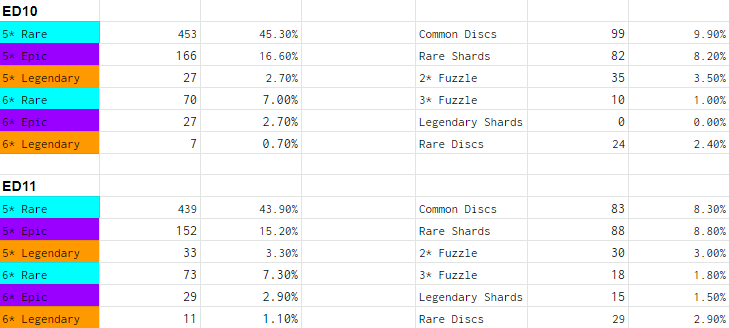
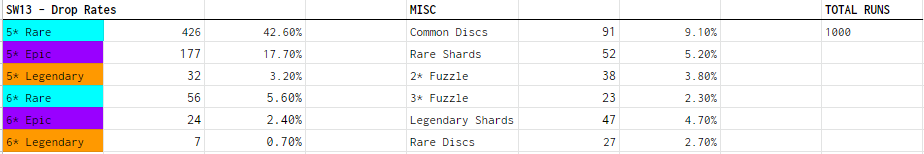
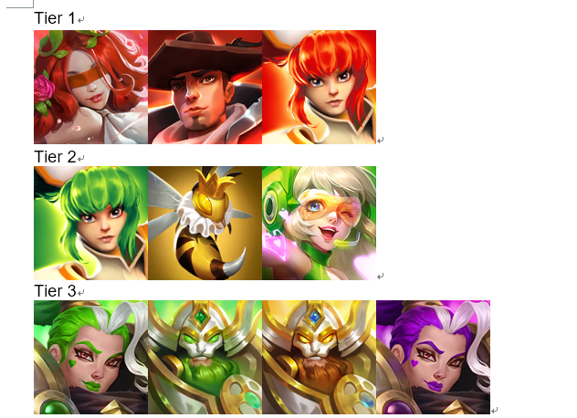
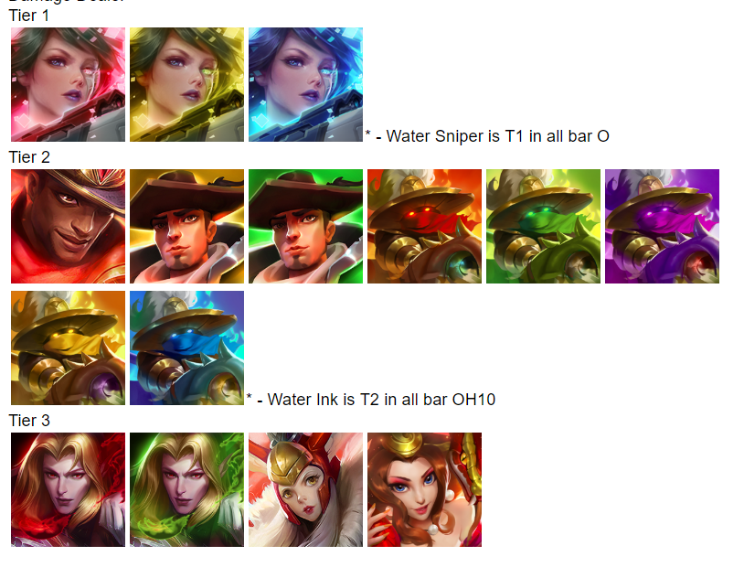

# 首领战

有三个 （raid boss ） 1. 龙 \(ED\) 2. 蜘蛛 \(SW\) 3. 异界 \(OH\)

> 括号里面是英文缩写 ， 蜘蛛10 就是 SW10 其实还有个牛头人魔王，不过因为格调太低，不能算进boss里面

## 龙

打boss的时候有两个电线杆（水晶），左边的会群体减防，右边的给龙加攻击。当然说这个没啥用，毕竟都是自动挂机，那两个电线杠都打不掉

值得注意的是龙会飞走，然后回来喷一下，这下伤害巨高，如果你团灭了，那还是升装备吧

挂龙10还是不难的，先把木武神练起来，超强辅助。 组队的话 光天使 ，木武神，其他感觉随意了。。比如水乌鸦，水时间都可以上，再来个输出。 总之只要龙吼那一下，你不挂人，就可以轻松过

### 11.16更新

这是给老鸟看的，新人跳过，直接去看 06.22 部分

以下是 龙10 和 龙11 的掉落比较，龙不飞的前提下优先刷龙11 . 龙不飞 解释一下就是在龙飞走前干掉他，时间一般在40-60s 内



### 06.22更新

为了方便新人，这里详细介绍下打龙套路，老鸟可跳过

打龙的优先buff是 **增加防御，护盾和增加攻击**

优先debuff是 **减少攻击及迷惑**

这里解释一下为什么，龙其实很简单，没什么特殊花样，就是有几次伤害高的攻击，只要这几次攻击你扛下来，过关只是时间问题。所以增加防御，护盾，主要是提高队伍生存率，减少攻击同理。有些人可能过于注重装备，而忽视了技能的选择，这里要纠正一下，**技能很重要，技能很重要，技能很重要**，不懂的可以进 [技能](../ji-chu/ji-neng.md) 看下技能说明，比如 增加防御，是70%，增加攻击是50%，如果你的辅助是全体上buff，这是多么大的提升。所以2星的木地精萨满，可以排上节奏榜A的位置，即便他是个2星，但是技能好，可以全体加攻击，加防御，debuff还有迷惑，减攻速，作为辅助来说，很合格了。这里只是举个例子，并不是说打龙就一定要上木地精萨满，毕竟他就是个2星。。。

然后讲下队伍配置，首领战可以上5个人，推荐的阵容如下

```text
1个治疗 （保命用）
1个护盾  (保命用)
2个辅助  (buff，debuff)
1个输出  (干boss)
```

以上仅是参考，更多是基于技能的选择，比如你有光天使，护盾和治疗二合一，可以多出一个位置上输出加速通关，或者再上个治疗求稳

注意 ，护盾 和 防御是两码事。护盾是给你一段额外的生命槽，相当于提高血量上限，防御就是增加防御

buff 和 debuff 刚才上面也说了，优先选择带有 减少攻击，迷惑，增加防御 这种

输出就很简单，靠平A也可以，技能的话推荐 持续伤害，比如水乌鸦，水时间都有这个

## 蜘蛛

因为蜘蛛掉 能手 装备，我的游戏理念是减CD就是王道，所以刷蜘蛛是重点

说一下蜘蛛的套路，

1. 会给自己上护盾，可以用水乌鸦破盾
2. 给自己上免疫，上无敌。这个可以通过水时间的阻挡增益阻止
3. 当队友死亡一个，蜘蛛必然会释放全屏激光，全屏伤害。。脆的话，很可能就团灭了。 常见的套路是 输出比较脆，蜘蛛平A干死了输出，然后全屏激光又干死两个血皮，血皮死掉，会再次释放激光。。然后肉盾和治疗也挂掉，不挂也剩一丝血，平A秒杀。。所以重点就是不要轻易go die，死一个就很可能崩盘，所以这里又再次体现出水少女的牛b之处。。水少女可以60s免死一次，简直是蜘蛛克星

刷蜘蛛的队伍，平民战队就可以，水乌鸦，水时间，木武神， 光天使（获取难一点），水蛇怪（存疑），如果你有水少女 或者 暗少女，可以把 水蛇怪替换掉。现在刚出的英雄 牧师 ，也可以上免疫效果

### 11.16更新

给老鸟看的，新人去看06.22

这是蜘蛛13的掉率。 根据老外的猜测，消耗体力一样的情况下，掉率是一样的。所以蜘蛛优先刷 10 or 11

想稳定的刷蜘蛛， 移除增益 ，阻挡增益 和 不死 是关键，推荐的英雄为： 水少女，木少女 ，光蜂王，暗时间



### 06.22更新

蜘蛛可不像打龙那么简单了，因为蜘蛛花样多，能给自己上无敌，攻速快，伤害高，而且时间越长，蜘蛛的攻击buff越强，比如后面攻击加个50%很正常，所以如果像打龙那样，单靠提高防御，加护盾，减攻击，那会死的很惨

还是先给个组队参考吧，毕竟这些老外都是试过的，而且那里面的参考很详细，不仅告诉你用什么英雄，还说了这个英雄的装备配置，甚至有的还把英雄的详细属性也写上，比如血量多少，精准度多少

[蜘蛛组队参考](https://dhcbuilds.com/elder-drake-guide/)

然后我这一部分你就当瞎掰好了，毕竟我蜘蛛卡在了第11关。。过不去了。。 打蜘蛛有几个技能非常必要

#### 1. 阻挡增益，移除护盾，移除增益，移除减益，免疫

因为蜘蛛的buff/debuff很多，而且很恶心，所以一定要有相关的技能。 比如 水乌鸦可以移除护盾，水时间可以阻挡增益，水少女可以移除减益等，水蛇怪提供全员无缝免疫等。

#### 2. 无敌，不死

因为蜘蛛有个特性，只要我方挂一人，就会释放全屏激光，这玩意一出来，不团灭也几乎是血皮，所以要尽量避免掉人，无敌免死技能可能需要抓时机，但是有些人的就很合群了，比如水少女，可以60s阻挡一次死亡，简直是蜘蛛克星。。这种技能效果的还有绿蜂王，光蜂王，不过是50%几率，不如水少女靠谱

#### 3. 降低攻速，增加攻击，降低防御等常规buff

因为蜘蛛攻速快，伤害也高，所以降低攻速可以显著提高队伍生存，增加攻击以及降低防御主要是要快速干掉boss，因为蜘蛛活的越久，伤害加成越高，后面很可能就翻车

## 异界

异界boss有一大堆特性，在 首领信息 可以看到，需要注意的就两条 ： 不能上技能有减cd的，不能上攻速快的，否则会有很难受的debuff，说人话就是不能上 武神，时间，仙子 英雄

多加一条最好是有 移除增益 阻挡增益，因为boss有再生buff，回血非常快

异界10是木属性，所以火属性优先。mvp绝对非火狙击莫属。想稳定快速的刷异界10，双火狙击是比较推荐的，或者一火一光也可以

我的异界10阵容： 双火狙击，火恶魔，火修女，光蜂王。稳定在2分钟左右 \(火修命中一定要高，移除boss的再生，火恶魔是为了用他的首领技能，用个天使感觉也不错\)

下面是翻译一个老外的论述，不代表本人观点，没有狙击的可参考：

#### 平民队伍：


#### 平民队伍：

1. 火修：能手+精准。 命中60+ ，三大件都生命，命中副属性凑
2. 火龙：枯萎+凋零 或者 凋零 \*3  。 三大件 1攻速，2生命 （我没用过这个，不发表意见）
3. 火武神：能手 + 凋零 （原文没有，我推荐是能手，加攻击，爆伤，暴击率）
4. 火魔枪：致命+敏锐 。两攻击 一个 CDMG ？ （不知道cdmg是啥，之所以说这个平民，是因为打会战能免费得）

首领技能用武神的

#### 异界辅助



#### 异界输出



## 牛头人

或许新人会有点难度，但这个其实是难度最低的，最高只有牛10，新人刷不过也不要急，装备起来就是无脑刷，推荐在掉落双倍的时候再刷，什么时候双倍可以关注末尾福利

## 总结

1. 龙 刷 生机 敏锐  疾速
2. 蜘蛛 刷 能手 精准
3. 异界 刷 好战
4. 牛头人 刷 药剂 

龙和蜘蛛是刷装备的地方 ， 等级在10以上，掉落5星起步。比如龙10，蜘蛛10掉装备，都是5星起 。等级11以上，有几率掉落传奇碎片

ps：装备作用远大于觉醒

## 终极总结

平民队伍

1. 光天使
2. 水少女
3. 水时间
4. 水乌鸦
5. 木武神

上面这个队伍，挂到蜘蛛12不是问题

三件百分比的装备，主属性恰当的话，升到15级。基本就保证过了

1. 光天使叠生命，其次命中
2. 水少女叠生命，其次命中
3. 水时间叠命中，其次生命，再其次攻击
4. 水乌鸦叠攻击，其次命中，再其次生命
5. 木武神叠命中，其次生命，再其次攻击

以上并不绝对，生命 和 攻击的次序看具体情况，站得住就优先叠攻击，站不住就叠生命。施放debuff的命中最好70+

