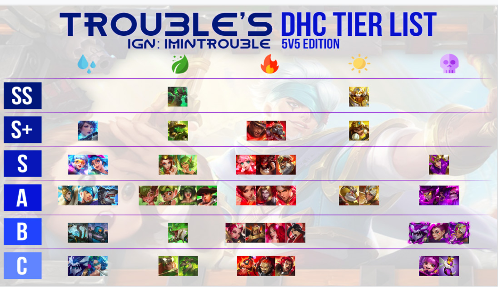

# PVP

我个人对PVP颇有经验，一个人单排到排行榜前10，就先说下pvp吧

## 没有商店，无法购买装备，道具

这游戏的pvp 没有装备的概念，pvp里没有商店，无法购买装备 或者 道具，PVE里的装备，也是无法带进pvp的，算是一种竞技平衡，否则你一套神装进pvp，打1级新人就跟切菜一样。。

## 英雄的5v5上限问题

最开始我以为pve和pvp完全分开，然而并不是

英雄的等级，和 是否觉醒，会影响英雄5v5属性的上限，这个在属性里看一下就知道了

不过影响的数值并不大，但对高玩来说，几点属性的差异，就可以决定胜败了

## 皮肤有加成

pvp里有皮肤的概念，pvp对竞技属性是有加成的，感觉并不好。不过数值一般控制在5%内，还可以接受

pvp的皮肤可以通过不断pvp拿积分，然后在 英雄-服饰 里解锁购买，升级。当然也可以直接氪金获得

## 满级15，有3技能

pvp 初始1级，与pve无关， 满级15级，有3个技能。 1，2技能游戏开始就给，3技能大招在你到达4级后解锁

pvp里有天赋，等级到达 1，5，9，12 会分别解锁一个，2选1的

## 排名25以内500钻

pvp有个好处是，排名是有钻石奖励的，比如前25名，每周会有500钻石，奖励算是很丰厚

但凡玩过dota，lol，王者荣耀中的任一款，拿到前25还是很轻松的

## 你打的可能是电脑

pvp理论上是玩家之间的pk，但是因为这游戏人气不够，经常会有电脑出现，也就是你一个人带4个电脑，去打5个电脑，还是很无语的

这里有个小技巧，如何判断对面是真人还是电脑，就是提示你准备的时候，你点准备上面的区域，进入准备界面，看对面的准备速度，如果是顺序准备的，基本就是电脑。如果对面准备的很快，或者无次序，很可能就是撞车了

## 单排上分

有两种方式

1. 单排获胜。好像1500分以下赢一次是8分。1700以上赢一次就是4分了
2. 对面有比你排名高的，打爆他，一把2，30十分不是梦

对面是什么队伍你决定不了，所以单排上分算是最稳妥的方式，避免撞车，可以通过上面的小技巧来决定这局开不开

> 注意，输掉也是有代价的

## 节奏榜参考

总的来说，这个游戏的pvp，更像是个半成品，游戏平衡性不佳。。英雄角色不同，会直接关系到你的输赢，下面给一个pvp英雄的排行参考 ，仅供参考。 这个是发于 2019年5月的

根据国内大神的说法，作图的老外练英雄都不全，所以这个排名没有意义。。

我个人觉得 石头人 这个排队是对的，其他看你自己发挥了

## pvp的奖励

打pvp是有箱子奖励的。每日是50积分， 每周是200积分

赢一次并且是mvp ，是20分。只是赢，是15分。输了是8分。输了但是mvp，是13分。

每日箱子有掉落英雄碎片，都是参加5v5的英雄

## 水狙击单排上分

根据我目前的体验，水狙击是单排上分最好的英雄之一，优势是跑得快，攻击高，打电脑无脑赢，看了本文，就再也不会出现双排输给5个电脑的情况

大前提：打电脑 或者 打1个人。 至于怎么打电脑，可以看上面的小技巧，依靠准备次序来判断

电脑的套路： 上路2个人，中路1个人，下路2个人 ，只知道前进推塔，除非剩一些血，否则不会回家，直到战死为止。。

我推荐的策略是选择 上路 ，会有一个电脑跟着你，你去打上路的那个带攻击buff的也怪，电脑也会跟着你打，然后你用1技能抢野怪人头，把攻击buff拿到手。之后电脑就上路对线了，你可以去把攻击buff野怪 上面的那个小怪给清了，能升到2级。然后再去上路对线

你到上路塔下，已经是2级，且带有攻击buff，或者运气不好，攻击buff被电脑抢到了，你看情况，适当走位，A几下，放技能，2个电脑都杀掉不算难，就算完成了开局的压制 。 之后就是无限压制，强势占据上路，电脑来了就杀，或者打回去。

推塔的时候放2技能，可以加攻击。跑路的时候也可以放2技能，跑得快

最后你推到上路高塔下，很可能的情况是你都8，9级了，电脑才4级左右，水狙击在有等级优势的时候，攻击非常变态，放大招2，3下，就能秒一个4级左右的英雄

因为上路电脑等级低，而且还是2个，死的快，活得也快，所以有时候上路高塔可能迟迟推不下来，可以考虑去中路。或者跟着你家的电脑一起推

打电脑的话，5-6分钟一盘算是正常情况，如果你方随机到好英雄，5分以内也是可能的

推1塔的时候，放跑电脑比杀掉更划算，因为电脑不会回城，残血只会跑回去，消耗的时间更多，能为你争取更多的推塔时间

### 新版套路

因为上路是2个电脑的配位，所以并非最优解。新的套路，适当压制上路后，就转中路去，帮己方的中路一起推，实现2v1的效果

注意的是，如果我方中路的电脑挂了，你得在他复活前，或者泉水里即将有人之前，你避开中路，这样才会有电脑补上来，否则中路就你一个

这个套路会比无脑推上路快一点，但是技术要求更高一点，因为你要保中路的电脑，并且还要担心上路会不会崩溃，被电脑推掉高塔

大部分此套路都可行，时间会比无脑推上路要快，平均4-5分结束

[视频教学](https://www.bilibili.com/video/av58991961)

